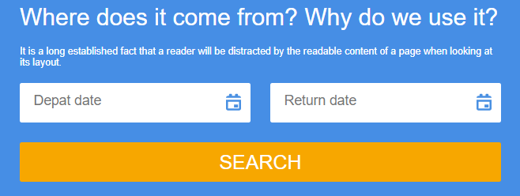

# Adaptive embeddable widget

This code provides the ability to insert an adaptive form widget on any site.

### Usage
---

To insert a widget on your site, simply paste this code into the place in your html-document where you want the widget to be.

```
<script type='module' src="https://cdn.jsdelivr.net/gh/mkh1n/form-widget@main/build/bundle.js"></script>
<div id="widget"></div>
```


