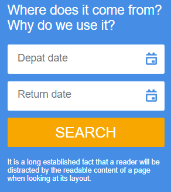

# Adaptive Embeddable Widget

This code provides the ability to insert an adaptive form widget on any site.

## Usage

To insert the widget on your site, simply paste the following code into the desired location in your HTML document:

```
<script type='module' src="https://cdn.jsdelivr.net/gh/mkh1n/form-widget@main/build/bundle.js"></script>
<div id="widget"></div>
```

## Screenshots




## About

This is a test task completed according to [this technical task](https://github.com/KosyanMedia/Front-end_TP_test).
